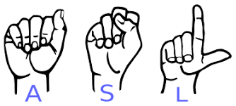

# 🧠 American Sign Language (ASL) Recognition from Hand Gestures

A real-time, production-inspired deep learning application for recognizing American Sign Language (ASL) from hand gestures using optimized video processing, object detection, and image classification. Developed in a **version-based modular pipeline**, this project demonstrates how to build, optimize, and deploy a scalable gesture recognition system that can be adapted for real-world use cases like accessibility tools, education, and human-computer interaction.

---

## 🚀 Version-Controlled Pipeline Development

### ✅ Version 1: Foundational Skeleton
Established a modular pipeline that initializes the object detection and image classification components, sets up video sources, and prepares the structure for further integration. This foundational structure reflects how real-time systems are architected before integrating functionality.

### ✅ Version 2: Integration of Object Detection into Live Video
Connected object detection directly into the live video stream pipeline. This enabled the system to detect hands in real-time, introducing minor latency. The integration mimics how production pipelines merge inference logic with I/O in live systems, exposing bottlenecks in performance.

### ✅ Version 3: Performance Optimization
Introduced latency-reduction strategies by:
- Downsampling video frames before inference to reduce computational load.
- Converting color space from BGR to RGB as required by TensorFlow.
- Reducing frame rate (FPS) to 15 for smoother and faster processing.

These are standard optimization practices in industry to enhance throughput and reduce inference time in live-streaming ML applications.

### ✅ Version 4: Multi-Model Pipeline Integration
Integrated image classification logic post object detection. Hand regions detected were passed into the classification model, and predicted classes were dynamically mapped to a local label dictionary. This stage represented full pipeline integration — a crucial step in building deployable AI systems.

### ✅ Version 5: Model Quantization for Production Efficiency
To further reduce latency introduced by classification, we:
- Converted the image classification model to a lightweight `.tflite` format.
- Applied float16 quantization to minimize model size and improve loading speed.
- Achieved lower inference latency, making the system more suitable for edge deployment (e.g., mobile or IoT).

---

## 🧪 Tech Stack

- **Programming Language**: Python 3.11.13
- **Deep Learning**: TensorFlow, Keras (EfficientNet backbone)
- **Computer Vision**: OpenCV, MediaPipe
- **Optimization**: TFLite Quantization, Frame Preprocessing
- **System Tools**: Conda, pip, JSON-based label mapping

---

## 🛠️ How to Run the Project

```bash
# Step 1: Create virtual environment
conda create -n <env_name> python=3.11.13

# Step 2: Activate environment
conda activate <env_name>

# Step 3: Install dependencies
pip install -r requirements.txt

# Step 4: Launch the pipeline
python run.py
```

---

## 📂 Folder Structure

```
ASL_Recognition/
│
├── model/
│   ├── quant_models/            # TFLite-quantized models (for optimized inference)
│   └── normal_models/           # Standard Keras (.h5) models
│
├── version_1/
│   ├── module.py                # Core logic for version 1 pipeline
│   └── run.py                   # Entry script for version 1
│
├── version_2/
│   ├── module.py
│   └── run.py
│
├── version_3/
│   ├── module.py
│   └── run.py
│
├── version_4/
│   ├── module.py
│   └── run.py
│
├── version_5/
│   ├── module.py
│   └── run.py
│
├── db.json                      # Class label to ASL mapping (or metadata DB)
├── requirements.txt             # Python dependencies
├── README.md                    # Project documentation
```

---

## ✨ Key Features

- 🎥 **Real-Time Sign Detection** from video or webcam
- 🧩 **Version-Based Modular Pipeline** for flexibility and scalability
- 🧠 **Multi-Stage Model Integration** combining object detection and classification
- ⚡ **Optimized for Performance** using downsampling and frame-rate tuning
- 📦 **Edge-Friendly Quantization** via TensorFlow Lite (float16 conversion)
- 💡 **Production-Oriented Design** suitable for deployment and scale

---

## 🧠 System Architecture

```
[Video Source]
      ↓
[Frame Preprocessing]
      ↓
[Hand Detection Model]
      ↓
[Extract Hand ROI]
      ↓
[Image Classification Model]
      ↓
[Class Mapping + Display Output]
```

---

## 📈 Possible Extensions

- 📱 Build a mobile app for ASL-to-speech
- 🔊 Add text-to-speech engine for each sign
- 🔁 Use sequence models (e.g., LSTMs or Transformers) for multi-sign detection
- 🌐 Host an API using Flask or FastAPI
- 💻 Create a web interface with Streamlit
- 🧠 Train with a larger ASL dataset for more vocabulary
- 🚀 Deploy on edge hardware (Raspberry Pi, Jetson Nano)

---

## 👨‍💻 Author

**Rohith Maddikunta**  
Deep Learning & Computer Vision Enthusiast  
📫 [LinkedIn](https://www.linkedin.com/in/rohith-maddikunta/) | ✉️ rohithmaddikunta@gmail.com

---

## 📜 License

This project is licensed under the **MIT License**.  
Use it freely with attribution.

---

## 🙌 Acknowledgements

- [TensorFlow](https://www.tensorflow.org/)
- [MediaPipe](https://mediapipe.dev/)
- [OpenCV](https://opencv.org/)
- Keras EfficientNet authors
